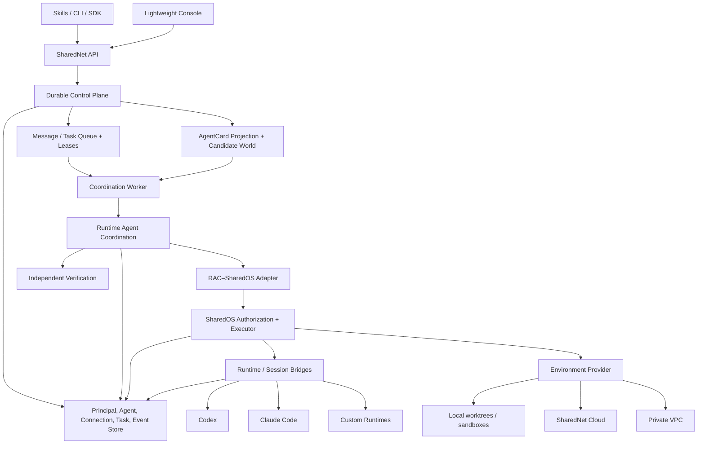

# System Boundaries and Reference Architecture

> **Status:** Working specification
>
> **Normative for:** SharedNet/RAC/SharedOS ownership, Session and Environment adapters, durable data model, dependency direction
>
> **Parent:** [`../../PRD.md`](../../PRD.md)

## 1. Composition

SharedNet is the product and durable composer. It reuses RAC for task-time organization, SharedOS for authorization and bounded execution, Session Bridges for runtime-specific reachability, and Environment providers for physical execution.

```text
SharedNet
├── Network control plane
│   ├── Principals and Agents
│   ├── AgentCards and discovery
│   ├── Principal Connections
│   ├── durable Messages and Tasks
│   └── policy, recovery, audit, and observability
├── Coordination
│   └── RAC
├── Authorization and bounded execution
│   └── SharedOS
├── Runtime reachability
│   └── Codex / Claude Code / custom Session Bridges
└── Environment providers
    └── local / SharedNet Cloud / private VPC
```

## 2. SharedOS boundary

SharedOS provides:

- structured security principal and origin addresses;
- deny-by-default capability grants;
- authorization preview and point-of-use enforcement;
- message envelopes and provenance contracts;
- permission-controlled files and resources;
- filtered tool discovery;
- bounded runtime execution;
- runtime adapters and typed security audit events.

SharedOS does not own:

- product account or Agent identity proofing;
- Principal Connections and Agent exposure;
- durable Task lifecycle, queues, schedules, or retries;
- Candidate World, ranking, or organization policy;
- endpoint presence or Session routing;
- product Console, billing, or long-term experience.

SharedNet compiles accepted Connection, Delegation, origin, and Task policy into SharedOS grants. It must not duplicate SharedOS point-of-use authorization.

## 3. RAC boundary

`RAC` always means **Runtime Agent Coordination**.

RAC provides:

- requirements and dependency ordering;
- `SELF`, `RECRUIT`, and `SPAWN` choices;
- admission/ranking inputs and host-owned estimates;
- bounded information contracts and recursion;
- cost, time, turn, depth, retry, contract, and active-participant budgets;
- verification, reroute, abstain, escalation, and stopping;
- an organization graph, protocol ledger, and terminal result;
- verification-backed coordination experience ports.

RAC does not own:

- durable Principal, Agent, Task, or Message lifecycle;
- live Candidate World indexing;
- network identity or AgentCard transport;
- endpoint presence, runtime delivery, or managed execution;
- capability authorization semantics.

The current coordinator may remain a bounded in-memory run. SharedNet persists the Task, Candidate Snapshot, inputs, events, and terminal ledger around it rather than turning RAC into a distributed product state machine.

## 4. Session Bridge boundary

CC-Direct/Aicoo-style infrastructure is a Session Bridge. It owns runtime attach, endpoint/session presence, last-mile delivery, correlation, runtime-specific resume/fork/fresh behavior, and interruption.

It does not own the Candidate World, Principal relationship, Task lifecycle, SharedOS grants, or cross-task experience. See [Runtime and Session Bridges](06-runtime-session-bridges.md).

## 5. Environment provider boundary

An Environment provider owns physical execution and persistence for local, SharedNet Cloud, or private placement:

- workspace materialization and snapshots;
- process/container/microVM lifecycle;
- provider-native isolation and networking;
- secret injection implementation;
- wake-up, background execution, and scale-to-zero;
- provider health and metering.

SharedNet owns semantic Agent, Task Environment, route, policy, and provenance state. Provider-native IDs are mappings, not network identity.

## 6. SharedNet control-plane boundary

SharedNet owns:

- Principal and Agent identity;
- Agent handles, lifecycle, and private profile source;
- caller-relative AgentCard projection policy;
- execution-route metadata and endpoint leases;
- Principal Connections;
- Candidate World indexing and Candidate Snapshots;
- Task, Message, Delegation, attempt, and checkpoint lifecycle;
- Graph Intent compilation;
- RAC hosting and persistence;
- scheduling, leases, retries, and recovery;
- verification-backed experience storage;
- product audit retention, billing references, and Console APIs.

## 7. System-of-record table

| Concern | System of record |
| --- | --- |
| Principal and Agent identity | SharedNet |
| Agent handle and exposure policy | SharedNet |
| Caller-relative AgentCard projection | SharedNet/provider Principal |
| Principal Connection | SharedNet |
| Task Search Scope and Graph Intent | SharedNet |
| Durable Task, Message, Delegation, and attempt lifecycle | SharedNet |
| Candidate World and Candidate Snapshot | SharedNet |
| Task-time organization and terminal ledger | RAC, persisted by SharedNet |
| Per-action capability authorization | SharedOS |
| Bounded runtime-turn result | SharedOS + runtime adapter |
| Runtime Session presence and transport state | Session Bridge, leased into SharedNet |
| Physical workspace, sandbox, and snapshot state | Environment provider |
| Semantic Agent home and Task Environment lineage | SharedNet |
| Cross-task verified coordination experience | SharedNet through RAC ports |
| Product audit retention and Console | SharedNet |

## 8. Dependency direction

```text
SharedNet → RAC
SharedNet → SharedOS
SharedNet → Session Bridge interfaces
SharedNet → Environment provider interfaces
RAC adapter → SharedOS

SharedOS -X→ SharedNet product code
RAC core -X→ SharedNet product code
Session adapter -X→ Candidate policy
Environment provider -X→ Agent identity semantics
```

Interfaces should remain narrow enough that each dependency can be tested with fakes and replaced without changing the product object model.

## 9. Asset reuse map

| Existing asset | Reuse | New SharedNet responsibility |
| --- | --- | --- |
| `SharedOS` | Capability model, grants, authorization, resource/tool boundary, bounded execution, audit contracts | Product identity, policy compilation, durable lifecycle, persistence |
| `network-of-agent/runtime-coordination` | TaskSpec, `SELF`/`RECRUIT`/`SPAWN`, admission/ranking, budgets, organization trace, verification, experience ports | Candidate World, durable RAC hosting, network-aware adapters, product UX |
| Aicoo Local Agent / CC-Direct | Live-session registration, delivery, correlation, retry spool, runtime-specific recovery | Message authority, Task binding, Principal/Delegation policy, SharedOS checks |
| `SharedOS-Cloud` | Product shell and compatible managed-control-plane components | Implemented Environment provider, isolation, snapshots, secrets, wake-up, metering |
| SharedNet repository | Composition point | Durable network objects, CLI/Skills, Console, APIs, queues, leases, recovery, observability |

Existing Cloud code must not be assumed to provide persistent isolated runtime execution until that capability is verified and implemented.

## 10. Core data model

| Entity | Purpose |
| --- | --- |
| `Principal` | Account-level ownership, trust, relationship, policy, billing, and audit boundary |
| `Agent` | Persistent accountable Agent owned by one Principal |
| `AgentHandle` | Human-readable alias with history |
| `AgentCardProjection` | Versioned caller/task-relative discoverable view |
| `AgentHomeEnvironment` | Logical persistent home for accepted workspace, memory, tools, and policy |
| `EnvironmentSnapshot` | Immutable checkpoint and lineage for restore or handoff |
| `ExecutionRoute` | AgentCard metadata describing eligible local, Cloud, or private execution |
| `RuntimeEndpoint` | Leased provider/runtime instance behind an execution route |
| `Session` | Resumable, forkable, or replaceable runtime context |
| `SpawnTemplate` | Approved recipe for a task-scoped worker |
| `Connection` | Versioned Principal-to-Principal relationship |
| `CandidateSnapshot` | Immutable task-attempt-specific admitted/rejected candidate set |
| `Task` | Durable user-visible goal, bounds, lifecycle, and acceptance |
| `TaskEnvironment` | Logical task working set, artifacts, checkpoints, and integration state |
| `GraphIntent` | Hard constraints, soft preferences, dependencies, and autonomy bounds |
| `Participant` | Task-time role backed by an Agent or SpawnTemplate |
| `ParticipantSandbox` | Isolated execution state for one participant |
| `Delegation` | Task-scoped Agent-to-Agent contract edge |
| `TaskAttempt` | Recoverable execution attempt with lease and lineage |
| `CoordinationRun` | One RAC invocation and terminal ledger |
| `Message` | Durable untrusted information envelope |
| `GrantRecord` | Policy input and reference to effective SharedOS grants |
| `Artifact` | Output/evidence with provenance and disclosure metadata |
| `Checkpoint` | Recoverable state boundary |
| `TraceEvent` | Ordered cross-system event reference |
| `ExperienceRecord` | Verification-backed observation used after admission |

## 11. Reference architecture



## 12. Architectural invariants

1. Do not merge RAC into SharedOS.
2. Do not make RAC the durable Task state machine.
3. Do not make Session Bridges the network control plane.
4. Do not duplicate SharedOS authorization inside SharedNet.
5. Do not model local, Cloud, or VPC placement as another Agent identity.
6. Do not model same-Principal Agent pairs as persistent Connections.
7. Do not let provider-native IDs become canonical product IDs.
8. Do not let multiple participants silently mutate one checkout.
