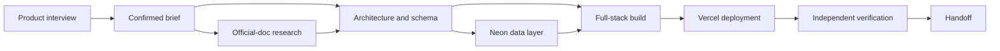

# Website Launch V1

> **Status:** Implemented V1
>
> **Normative for:** the first end-to-end SharedNet demo, requirement discovery, official Agent organization, website build, Neon provisioning, Vercel deployment, and handoff
>
> **Parent:** [`../../PRD.md`](../../PRD.md)

## 1. Outcome

> **Give SharedNet a product idea. It asks until the idea is buildable, assembles an official specialist team, researches the stack, builds the application, provisions its data layer, deploys it, verifies it, and hands back a working product with evidence.**

The demo wedge is a full-stack website because it makes coordination legible and produces an externally verifiable result.

```text
one-sentence idea
  ↓
adaptive requirement interview
  ↓
confirmed Product Brief
  ↓
official Agent organization
  ↓
research constraints + architecture + generated source + database/deployment plans
  ↓
deterministic verification + interactive preview
  ↓
simulated or guarded-live manifest + source + evidence
```

## 2. Demo truth boundary

V1 is a hybrid product demo with two execution modes.

### Demo mode

Demo mode is deterministic and requires no external credentials. It executes the real interview, state machine, Agent selection, task graph, artifact generation, and verification model while returning clearly labeled simulated Neon and Vercel resources.

### Live connector mode

Live connector mode is available only when the operator explicitly enables it, server-side credentials exist, and the user explicitly approves external resource creation. It may:

- create a Neon project through `POST https://console.neon.tech/api/v2/projects`;
- retrieve a pooled connection URI server-side;
- create/configure a Vercel project and environment variables;
- create a Vercel deployment;
- return redacted creation manifests for later provider-side verification.

Polling provider operations, validating a deployed URL, and production promotion remain follow-up work. A partial or uncertain write stops in `reconciliation-required` and cannot advance the Mission to handoff.

Tokens and database credentials never enter client state, Agent messages, traces, or downloadable artifacts. Demo output must never be labeled as a real external resource.

## 3. Target user and starting state

The first user is a technical or product-capable founder who can describe an application but should not need to choose infrastructure, coordinate specialists, or manually wire deployment.

The default starting state is a blank project plus one sentence, for example:

> Build a customer-feedback board where users can submit ideas and vote, and give the team a private moderation view.

V1 does not require an existing repository. Importing and modifying an existing repository is a later extension of the same Mission.

## 4. Requirement interview

The Product Agent asks only questions that materially change architecture, scope, design, risk, or acceptance. It must cover:

- primary user and problem;
- core action and minimum success loop;
- data that must persist;
- authentication and roles;
- external integrations;
- visual direction and reference products;
- launch audience and environment;
- irreversible or sensitive side effects;
- explicit acceptance criteria.

Each answer updates a visible readiness model:

```text
Problem        clear / uncertain
Users          clear / uncertain
Core loop      clear / uncertain
Data           clear / uncertain
Access         clear / uncertain
Visual intent  clear / uncertain
Launch         clear / uncertain
Acceptance     clear / uncertain
```

SharedNet stops interviewing when the remaining unknowns do not materially alter the first build. It records deferred choices instead of asking endlessly.

The user confirms one concise Product Brief before build execution.

## 5. Official Agent bench

V1 preloads persistent Agents owned by the SharedNet Principal. “Official” means maintained by SharedNet; it does not imply endorsement or operation by Neon or Vercel.

| Agent | Role | Typical deliverable |
| --- | --- | --- |
| `@sharednet/product` | Requirement discovery and scope | Product Brief and acceptance checklist |
| `@sharednet/research` | Product and integration constraint research | Architecture inputs recorded in the Mission trace |
| `@sharednet/architect` | System and data design | Architecture, schema, API and risk plan |
| `@sharednet/builder` | Full-stack implementation and integration | Source tree and build report |
| `@sharednet/neon` | Neon provisioning and database verification | Database manifest, migration evidence, redacted connection status |
| `@sharednet/vercel` | Vercel project and deployment | Deployment manifest, URL and build events |
| `@sharednet/quality` | Independent verification | Browser checks, acceptance evidence and unresolved issues |

AgentCards expose capabilities, provenance, availability, and route metadata. The UI displays “SharedNet official,” task role, and why RAC selected each Agent.

## 6. RAC organization

The user never manually assembles the team. RAC derives the smallest useful organization from the Product Brief.

The canonical data-backed website graph is:



Conditional policy:

- omit `@sharednet/neon` when no persistent data is needed;
- omit deployment until local build verification passes;
- add a focused repair attempt after build or browser verification failure;
- require explicit user approval before real project creation or production promotion;
- stop and explain when credentials, authority, or acceptance evidence are missing.

## 7. User experience

V1 is one Mission workspace with six stages.

### Stage 1 — Describe

A large prompt asks what the user wants to launch. A sample idea can start the demo immediately.

### Stage 2 — Clarify

The Product Agent asks one material question at a time. A readiness rail shows which decisions are clear, inferred, or deferred.

### Stage 3 — Confirm

SharedNet produces a concise editable Product Brief, acceptance checklist, assumptions, and external actions requiring approval.

### Stage 4 — Organize

Candidate World becomes visible. RAC selects official Agents and renders their dependency graph with selection reasons.

### Stage 5 — Build

The Mission view streams meaningful events rather than fake token logs:

- research and integration constraints accepted;
- architecture and schema accepted;
- files and migrations produced;
- Neon project ready or simulated;
- local build/test result;
- Vercel deployment state or simulation;
- browser verification and repair.

### Stage 6 — Handoff

The result includes:

- live or clearly labeled demo URL;
- application preview;
- source bundle/repository artifact;
- Product Brief and architecture;
- database and deployment manifests with secrets redacted;
- acceptance evidence;
- selected organization, dependency-wave count, and unresolved infrastructure state;
- recommended next iteration.

## 8. Application architecture

The demo application is a TypeScript web application with four focused layers:

```text
Mission UI
  ↓
Interview + brief compiler
  ↓
Deterministic RAC demo orchestrator
  ↓
Artifact generator + Connector ports
                        ├── Neon demo/live adapter
                        └── Vercel demo/live adapter
```

### Mission model

The minimum persisted/client-restorable model contains:

- Mission ID, title, idea, and stage;
- interview questions, answers, readiness, assumptions, and Product Brief;
- selected AgentCards and RAC dependency graph;
- task states, events, attempts, and approval gates;
- generated artifacts and preview model;
- connector mode and redacted manifests;
- verification checklist and final outcome.

### Connector contract

Every provider adapter implements:

```text
inspectCapability()
plan(input)
requireApproval(plan)
execute(approvedPlan)
verify(result)
redact(result)
```

Provider calls remain behind server routes. Retries of non-idempotent resource creation require reconciliation rather than blind repeat.

## 9. Demo-mode behavior

The no-credential experience must be complete and honest:

- all Agent decisions and Task transitions execute locally;
- generated identifiers and URLs use obvious demo namespaces;
- infrastructure cards display `SIMULATED`;
- source and architecture artifacts are real downloadable text generated from the brief/template;
- the embedded application preview is interactive;
- deterministic verification checks run against the generated preview model and the application test suite covers the primary interactive flow;
- refreshing the page can restore the active Mission from local storage.

## 10. Live-mode safeguards

- Credentials are read only on the server from environment variables.
- Live writes require a separate operator opt-in and are limited to a trusted, access-controlled, single-user V1 instance.
- The client sees capability availability, never token values.
- Every external mutation has a human-readable plan and explicit approval.
- Neon connection URIs are stored transiently server-side and redacted in logs/results.
- Vercel environment variables are written server-side and never echoed.
- Production promotion and custom domains are outside the first demo.
- Failed non-idempotent calls enter reconciliation state before retry.
- Cleanup remains manual unless a separately approved deletion plan exists.

## 11. Acceptance criteria

1. A new user can enter one sentence and complete the requirement interview without configuring Agents.
2. The interview covers user, core loop, data, access, visual intent, launch, and acceptance, while allowing non-material details to be deferred.
3. SharedNet produces a confirmed Product Brief and selects at least four justified official Agents for the sample data-backed site.
4. The organization graph and event timeline visibly follow dependency order.
5. The generated website preview is interactive and reflects the chosen product direction.
6. Demo mode completes without credentials and labels every simulated external resource.
7. Neon and Vercel adapters expose real official-API contracts behind server-only boundaries.
8. External mutations cannot occur without credentials and explicit approval.
9. The final handoff includes preview, source/architecture artifacts, redacted infrastructure manifests, and verification evidence.
10. The project builds cleanly and automated tests cover interview readiness, RAC graph transitions, connector mode/safety, and handoff completeness.

## 12. Non-goals

- arbitrary website generation across every framework;
- production-grade multi-tenant persistence;
- OAuth installation flows for Neon, Vercel, or GitHub;
- custom domains or production promotion;
- autonomous spending or deletion;
- pretending that simulated infrastructure is live;
- implementing the complete distributed SharedNet protocol before proving the outcome.

## 13. Official references

- [Neon API: create project](https://api-docs.neon.tech/reference/createproject)
- [Neon API: authentication](https://api-docs.neon.tech/reference/authentication)
- [Neon API: retrieve connection URI](https://api-docs.neon.tech/reference/getconnectionuri)
- [Vercel REST API](https://vercel.com/docs/rest-api)
- [Vercel deployment methods](https://vercel.com/docs/deployments/overview)
- [Vercel environment variables](https://vercel.com/docs/environment-variables)
