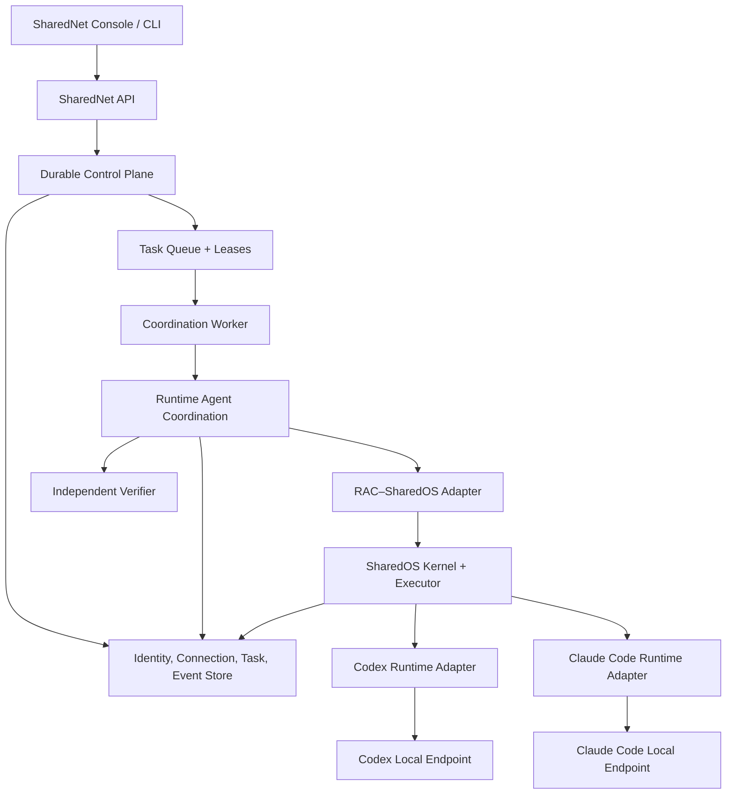

# SharedNet — Product Requirements Document

> **Status:** Draft v0.2 — product and architecture review
>
> **Owner:** Xisen Wang
>
> **Date:** 2026-08-24
>
> **Composition:** SharedNet = durable product host + SharedOS + Runtime Agent Coordination (RAC) + runtime endpoints

## 0. Executive summary

> **SharedNet is a programmable network through which independently running agents become addressable, authorized, and able to complete work together.**

SharedNet answers:

> **How do agents find each other and work together?**

SharedNet Cloud answers a separate question:

> **Where can an agent run when its owner wants a managed runtime?**

The architectural principle is:

> **SharedNet does not care where an agent runs. SharedNet Cloud is simply the easiest place to run one.**

An agent has one persistent identity and may expose multiple execution endpoints:

```text
Agent: agent://coding@xisen
├── Local endpoint: Claude Code on Xisen's Mac
├── Local endpoint: Codex on Xisen's Mac
├── Cloud endpoint: SharedNet Cloud
└── Private endpoint: Systemind VPC
```

An endpoint is not another agent. Moving execution does not clone identity, grants, relationships, or accountability.

## 1. Product thesis

Agent runtimes are becoming persistent, capable, and attached to valuable local context. They can operate files, tools, credentials, repositories, and workflows, but they remain isolated by runtime, machine, owner, and organization.

SharedNet turns those isolated runtimes into a governed network by adding four things:

1. **Stable identity** — identify an agent independently of its current process or runtime.
2. **Explicit relationships and authority** — compute what two agents may request, access, execute, and disclose.
3. **Durable work** — retain tasks, messages, state, provenance, and recovery across disconnects and restarts.
4. **Bounded coordination** — dynamically choose collaborators, delegate, verify, recover, and stop within explicit limits.

The system is built from two existing technical assets and one new product layer:

```text
SharedOS  = permission-controlled execution substrate
RAC       = runtime coordination mechanism
SharedNet = durable network control plane and product host
```

## 2. Product hierarchy

SharedNet is the parent product. Cloud, RAC, Console, and SDK are subproducts or capabilities, not separate brands.

```text
SharedNet
├── Network
│   ├── Identity
│   ├── Connections
│   ├── Discovery
│   ├── Messaging
│   ├── Tasks
│   ├── Permissions
│   └── Observability
├── RAC
│   ├── Candidate selection
│   ├── Recursive delegation
│   ├── Verification and recovery
│   └── Experience
├── Cloud
│   ├── Managed runtime
│   ├── Persistent workspace
│   ├── Files and secrets
│   ├── Background execution
│   └── Scale-to-zero compute
├── Console
└── SDK / Skills
```

Recommended URLs:

```text
sharednet.ai
sharednet.ai/cloud
sharednet.ai/rac
sharednet.ai/docs
```

## 3. What SharedNet is not

| SharedNet is not                       | Boundary                                                                                     |
| -------------------------------------- | -------------------------------------------------------------------------------------------- |
| A multi-agent orchestration framework  | It does not assume one developer, one process tree, or one trust domain.                     |
| A hosted-agent-only product            | Local, Cloud, and private VPC runtimes participate through the same protocol.                |
| A replacement for Claude Code or Codex | Existing harnesses remain execution endpoints.                                               |
| A global public agent directory        | Global uniqueness, resolvability, discoverability, and reachability are separate properties. |
| A generic agent chat product           | Messages carry information; durable tasks carry accountable work.                            |
| A second authorization system          | All execution authority compiles to and is enforced by SharedOS grants.                      |
| An identity clone system               | One agent identity may execute in several places; execution origin remains explicit.         |

## 4. Existing assets and ownership boundaries

### 4.1 SharedOS

SharedOS already provides:

- structured agent, human, group, and service addresses;
- deny-by-default capability grants and authorization;
- message envelopes, routing, and provenance contracts;
- a canonical permission-controlled `files` resource plane;
- filtered tool discovery and point-of-use tool authorization;
- a fixed execution security envelope;
- pluggable one-turn runtimes through `RuntimePlugin`;
- embedded and HTTP boundaries over the same contracts;
- typed audit events.

SharedOS intentionally does not own:

- product accounts or identity proofing;
- durable task lifecycle;
- product inboxes and notifications;
- runtime presence and endpoint leases;
- retries, schedules, queues, or background execution;
- task decomposition, collaborator selection, or network stopping;
- production persistence.

SharedOS remains an independent library. SharedNet depends on SharedOS; SharedOS never imports SharedNet or RAC.

### 4.2 Runtime Agent Coordination (RAC)

`RAC` always means **Runtime Agent Coordination**.

RAC already provides a substrate-neutral mechanism for one bounded task-level coordination run:

- task requirements and dependency ordering;
- `SELF`, `RECRUIT`, and `SPAWN` candidate modes;
- admission before ranking;
- host-owned candidate estimates and marginal-utility ranking;
- attenuated information contracts;
- recursive, scoped `resolve(...)`;
- task-wide depth, cost, turn, spawn, contract, and deadline budgets;
- independent work and final verification;
- retry, reverify, reroute, abstain, escalate, and stop decisions;
- organization graph, trace, protocol ledger, and terminal result;
- verification-backed coordination capital and experience interfaces;
- SharedOS and Codex adapters.

RAC intentionally does not own:

- network identity or principal accounts;
- capability authorization semantics;
- durable product task status;
- queues, cron, endpoint presence, or notifications;
- federated discovery;
- production persistence;
- managed Cloud execution.

The current RAC coordinator holds an active run in memory and returns a terminal result. SharedNet must persist lifecycle state before, during, and after each RAC invocation.

### 4.3 SharedNet

SharedNet owns the durable host responsibilities left open by SharedOS and RAC:

| Concern                                               | System of record                  |
| ----------------------------------------------------- | --------------------------------- |
| Principal and agent identity                          | SharedNet                         |
| Agent handle and lifecycle                            | SharedNet                         |
| Runtime endpoint registration and presence            | SharedNet                         |
| Connection and effective collaboration contract       | SharedNet                         |
| Durable message and task lifecycle                    | SharedNet                         |
| Scheduling, leases, retries, and recovery             | SharedNet                         |
| Per-action authorization decision                     | SharedOS                          |
| One bounded runtime-turn result                       | SharedOS                          |
| One task-level coordination trace and terminal ledger | RAC, persisted by SharedNet       |
| Cross-task verified coordination experience           | SharedNet store through RAC ports |
| Product audit retention and console                   | SharedNet                         |

## 5. Non-negotiable invariants

### I1 — Identity is not runtime

An agent identity represents an accountable service boundary. It does not identify a process, session, model invocation, machine, or endpoint.

### I2 — Addressability is not authority

Knowing how to reach an agent never grants permission to message it, invoke it, inspect its state, or use its tools.

### I3 — Messages never mint authority

A message conveys intent and context. Only a grant independently evaluated by SharedOS conveys authority.

### I4 — One identity may have multiple endpoints

Endpoint selection changes execution origin, latency, cost, freshness, and available context. It does not create a new agent identity.

### I5 — Execution origin is always visible

Every result records the agent identity, runtime endpoint, runtime implementation, model when available, context freshness, and trace lineage. The UI and API must not hide whether execution occurred locally, in SharedNet Cloud, or in a private runtime.

### I6 — Coordination is bounded

Every RAC run has explicit limits for deadline, cost, agent turns, spawned agents, information contracts, recursion depth, active agents, and attempts.

### I7 — Experience is not authority

Verified experience may change ranking, prompts, or policy parameters. It can never grant a capability or bypass admission.

### I8 — Origin restrictions only narrow across delegation

Future cross-principal tasks must carry their origin chain and disclosure ceiling through every delegation. An internal hop cannot convert an external request into unrestricted internal authority.

### I9 — Durable state has one owner

SharedNet is authoritative for task and endpoint lifecycle. SharedOS and RAC return validated decisions and results; they do not maintain competing product state machines.

## 6. Identity, endpoint, and connection model

### 6.1 Identifiers

```text
Principal ID     principal:xisen
Agent ID         aid:xisen:7Qx91L
Agent handle     agent://coding@xisen
Endpoint ID      endpoint:macbook:codex:8f72
Task ID          task:492
Coordination ID  coordination:492:attempt:1
```

- Canonical IDs are immutable and never recycled.
- Handles are human-readable and may be renamed while preserving alias history.
- Runtime endpoints are replaceable and may expire.
- Sessions and ephemeral subagents do not receive persistent Agent IDs unless they satisfy the full accountability boundary.

### 6.2 Runtime endpoint

A runtime endpoint advertises:

```yaml
endpoint_id: endpoint:macbook:codex:8f72
agent_id: aid:xisen:7Qx91L
runtime: codex
execution_location: local
status: online
capabilities: [code_review, repository_questions]
workspace_refs: [repo:sharednet]
lease_expires_at: 2026-08-24T12:00:30Z
```

Presence is lease-based. A stale lease makes an endpoint unavailable without revoking the agent identity.

### 6.3 Connection

A connection is the central relationship primitive. It answers:

> What may these two agents ask of one another, access, execute, disclose, delegate, and spend?

The effective connection contract is computed deterministically from:

```text
principal policy ceiling
× connection template
× explicit grants
× task origin restrictions
× current approval state
```

It compiles to SharedOS capability grants. SharedNet does not implement a second execution-time evaluator.

## 7. Durable message and task model

### 7.1 Message versus task

- **Message:** one information delivery event.
- **Task:** a durable coordination object with ownership, lifecycle, budget, deadline, evidence, and terminal acceptance.

### 7.2 Task lifecycle

```text
Requested
   ├── Rejected
   └── Accepted
         ├── Queued
         └── Running
               ├── Waiting for approval
               ├── Failed
               ├── Cancelled
               ├── Expired
               └── Completed
                     ├── Verification failed
                     └── Verified
```

RAC terminal statuses do not replace this product lifecycle. SharedNet records each RAC invocation as a coordination attempt and maps its terminal result into a valid task transition.

### 7.3 Delivery and recovery semantics

- Task submission is at-least-once with an idempotency key.
- A queued task survives agent and SharedNet process restarts.
- A worker claims a task using an expiring lease.
- Lease expiry makes work eligible for recovery; it does not silently mark the task failed.
- Every retry creates an attempt record and preserves previous evidence.
- Side-effecting operations require idempotency or an explicit approval boundary.
- State changes and emitted events use a transactional outbox or equivalent atomic mechanism.
- Revocation is checked again before every protected action.

## 8. SharedNet V0 — approved scope

### 8.1 V0 promise

> **Connect two local agents and let them complete one durable, authorized, verified task together.**

The initial user owns one local principal and runs two existing agent runtimes:

```text
Claude Code local endpoint
          │
          ├── SharedNet connection + durable task
          │
Codex local endpoint
```

RAC coordinates the task. SharedOS authorizes and executes each bounded turn. SharedNet persists identity, connection, task state, attempts, events, and results.

### 8.2 V0 user flow

```text
1. Start SharedNet locally
2. Register one local principal
3. Connect a Codex endpoint
4. Connect a Claude Code endpoint
5. Create stable Agent IDs and handles
6. Establish an explicit same-principal connection
7. Submit a durable task to one agent
8. SharedNet claims and starts the task
9. RAC discovers and selects an authorized collaborator
10. SharedOS executes bounded turns and tool calls
11. RAC verifies the result and returns its terminal ledger
12. SharedNet persists the result and renders the complete trace
```

### 8.3 V0 functional requirements

#### F0 — Local product host

- Run as one local SharedNet service.
- Own the durable database, queue, task state machine, endpoint leases, and event log.
- Restart without losing registered agents, connections, queued tasks, attempts, or terminal results.

#### F1 — Local principal and persistent agent identity

- Create one local principal during onboarding.
- Register at least two persistent Agent IDs under that principal.
- Support immutable canonical IDs and mutable handles.
- Do not assign persistent Agent IDs to one-off sessions or spawned workers.

#### F2 — Runtime endpoint adapters

- Support one Codex endpoint and one Claude Code endpoint.
- Register endpoint runtime, version, capabilities, workspace references, and lease.
- Translate a SharedNet task into the runtime-specific invocation format.
- Return trusted execution origin, usage, events, outputs, and evidence.
- Preserve local refusal and cancellation control.

#### F3 — Connection contract

- Create an explicit same-principal connection between the two agents.
- Compute an effective contract deterministically.
- Compile allowed capabilities into SharedOS grants.
- Support connection expiry and revocation.
- Record both allowed and denied decisions.

#### F4 — Durable tasks

- Persist task before acknowledging submission.
- Support the V0 task lifecycle and append-only transition events.
- Queue work while an endpoint is offline.
- Use idempotency keys for submission and attempt execution.
- Preserve every attempt and terminal reason.

#### F5 — RAC composition

SharedNet provides production implementations for RAC ports:

| RAC port                   | SharedNet V0 implementation                                             |
| -------------------------- | ----------------------------------------------------------------------- |
| `AgentDirectory`           | Registered local agents and declared neighbors                          |
| `AdmissionGate`            | SharedOS preview and point-of-use authorization                         |
| `ContractMessenger`        | Durable task/message delivery                                           |
| `EphemeralSpawner`         | Disabled in V0 unless explicitly enabled for one bounded local template |
| `AgentExecutor`            | Runtime endpoint adapter through SharedOS                               |
| `IndependentVerifier`      | One explicit structural/task verifier                                   |
| `CandidateSelectionPolicy` | Deterministic policy with host-owned estimates                          |
| `CoordinationCapital`      | Persisted verified snapshots                                            |
| `CoordinationExperience`   | Persisted but not used for learned routing in V0                        |

- Persist RAC events as they occur through `onEvent`.
- Persist the terminal organization graph, trace, usage, snapshots, and ledger.
- Do not expose RAC coordinator internals to agents.

#### F6 — SharedOS composition

- Derive `AccessContext` only from trusted SharedNet state.
- Use SharedOS as the only capability authorization engine.
- Route all model-visible tools through the SharedOS broker.
- Re-authorize exact calls at point of use.
- Record runtime and protocol provenance for every bounded turn.
- Keep the SharedOS package free of SharedNet- or RAC-specific imports.

#### F7 — Minimal Console

The V0 Console must answer:

```text
Which agents are registered?
Which endpoints are online?
What may the agents do together?
Which tasks are queued or running?
Who actually executed each step?
Why did a task complete, fail, or get denied?
```

For one completed task, the user can inspect the task transitions, RAC organization graph, SharedOS authorization decisions, runtime origin, evidence, usage, and terminal verification.

### 8.4 V0 acceptance criteria

1. A new user connects one Codex and one Claude Code endpoint within ten minutes.
2. Both endpoints are represented by stable Agent IDs independent of their sessions.
3. One agent submits a task that recruits the other through RAC.
4. SharedOS denies any capability outside the effective connection contract and records a readable reason.
5. Killing either runtime before task pickup leaves the task queued and recoverable.
6. Restarting SharedNet does not lose identities, connection state, task state, attempts, or events.
7. A successful task produces a verified RAC terminal result and a complete SharedNet task trace.
8. Replaying the same submission idempotency key does not create a second task.
9. Revoking the connection prevents new protected actions and produces an audit event.
10. No runtime endpoint can inspect grants, issuing authority, or another endpoint's hidden tool catalog.

### 8.5 Explicitly out of scope for V0

- SharedNet Cloud and remote managed execution;
- public or global registry;
- cross-organization federation;
- domain-based principal verification;
- public discovery and OnCall marketplace behavior;
- learned routing or adaptive topology;
- global reputation and settlement;
- cron and recurring tasks;
- generalized parallel fan-out;
- arbitrary shared-artifact conflict resolution;
- billing, pricing, and enterprise SSO;
- irreversible external side effects without explicit human approval.

## 9. V0 reference architecture



Dependency direction:

```text
SharedNet App
  ├── depends on RAC contracts/core/adapters
  └── depends on SharedOS contracts/core/runtime

RAC adapters → SharedOS
SharedOS      -X→ RAC or SharedNet
RAC core      -X→ SharedNet product code
```

## 10. Core data model

| Entity            | Purpose                                                           |
| ----------------- | ----------------------------------------------------------------- |
| `Principal`       | Accountable authority boundary for V0 local ownership             |
| `AgentIdentity`   | Persistent accountable agent independent of execution             |
| `AgentHandle`     | Human-readable alias and history                                  |
| `RuntimeEndpoint` | Leased local, Cloud, or private execution location                |
| `Connection`      | Relationship and versioned effective contract between agents      |
| `Task`            | Durable user-visible work object and lifecycle                    |
| `TaskAttempt`     | One leased execution attempt with retry lineage                   |
| `CoordinationRun` | One RAC invocation and terminal result                            |
| `Message`         | Durable information envelope linked to a task when applicable     |
| `TraceEvent`      | Ordered product, RAC, SharedOS, and runtime event reference       |
| `GrantRecord`     | SharedNet policy input and reference to effective SharedOS grants |
| `Artifact`        | Output or evidence with provenance and disclosure metadata        |

The same information must not be independently mutable in multiple entities. In particular:

- endpoint presence belongs to `RuntimeEndpoint`;
- user-visible lifecycle belongs to `Task`;
- retry lineage belongs to `TaskAttempt`;
- RAC internals belong to `CoordinationRun`;
- authorization outcomes remain immutable SharedOS decision records.

## 11. Failure behavior

| Failure                                      | Required behavior                                                                         |
| -------------------------------------------- | ----------------------------------------------------------------------------------------- |
| Endpoint offline before pickup               | Keep task queued; show unavailable endpoint and next retry policy.                        |
| Endpoint disappears during a turn            | End attempt with an attributable failure; recover only within task limits.                |
| SharedNet process restarts                   | Reclaim expired leases and resume from durable task state.                                |
| Duplicate submission                         | Return the existing task for the same idempotency key and request hash.                   |
| Same key with different input                | Reject as an idempotency conflict.                                                        |
| Authorization revoked                        | Deny the next protected action; transition or pause task according to policy.             |
| RAC exhausts budget                          | Persist the complete terminal ledger and mark the task with an explicit exhausted reason. |
| Verification is inconclusive                 | Do not mark the task verified; retry, escalate, or fail according to the task policy.     |
| Audit persistence fails around a side effect | Fail closed or use an atomic outbox; never report an unaudited successful mutation.       |

## 12. V0 non-functional requirements

| Dimension     | V0 requirement                                                                                     |
| ------------- | -------------------------------------------------------------------------------------------------- |
| Durability    | Acknowledged tasks and transitions survive process restart.                                        |
| Authorization | Every protected action passes through SharedOS; deny paths are tested.                             |
| Idempotency   | Submission and externally visible mutations have durable idempotency controls.                     |
| Isolation     | Principal, agent, endpoint, task, and file namespaces cannot cross accidentally.                   |
| Observability | Every task has ordered lifecycle, coordination, authorization, runtime, and verification evidence. |
| Recovery      | Expired worker leases can be reclaimed without erasing earlier attempts.                           |
| Boundedness   | Every RAC run enforces cost, time, turn, depth, active-agent, and attempt limits.                  |
| Local control | A local endpoint may refuse, cancel, or disconnect without losing durable network state.           |

## 13. Delivery sequence

### M0 — Contract alignment

- Freeze V0 Agent ID, Endpoint, Connection, Task, TaskAttempt, and CoordinationRun contracts.
- Define deterministic connection-to-SharedOS-grant compilation.
- Define RAC terminal-result-to-task-transition mapping.
- Add golden contract and denial tests.

**Exit:** two independent endpoint adapters can exchange one schema-valid, authorized task through the same SharedNet host contracts.

### M1 — Local vertical slice

- Local principal and two persistent Agent IDs.
- Codex and Claude Code endpoint registration.
- Explicit connection contract.
- Durable task submission and pickup.
- One RAC coordination run through SharedOS.
- Minimal trace view.

**Exit:** one agent recruits the other and completes one verified task end to end.

### M2 — Durability and recovery

- Endpoint leases and offline queueing.
- Worker leases, idempotency, attempts, restart recovery, and revocation.
- Persistent RAC event stream, terminal ledger, and experience snapshots.
- Failure-path and crash-recovery tests.

**Exit:** kill and restart every participating process at defined checkpoints without losing acknowledged task state or provenance.

### M3 — Internal dogfood

- Run several real tasks each day through the local network.
- Measure denial quality, completion rate, coordination cost, recovery, and manual intervention.
- Freeze the V0 public integration contract after dogfood evidence.

**Exit:** the team uses the local network for one week without manually sharing runtime credentials between agents.

### Later — capability expansion

```text
V1  SharedNet Cloud managed endpoint and detach/continue
V2  Company agent network and governance
V3  Federated cross-principal connections
V4  Public discovery, verified history, and learned coordination
```

## 14. Success metrics

### V0 north star

> **Verified multi-agent tasks completed per active local network per week.**

Supporting metrics:

- median time from install to two connected agents;
- task acceptance, completion, and verification rate;
- percentage of tasks surviving an endpoint or host restart;
- percentage of denied actions with a readable reason;
- average RAC turns, cost, and wall time per verified task;
- manual credential or API-key sharing incidents;
- duplicate task or side-effect incidents;
- unauthorized disclosure incidents.

Counter-metrics:

- message volume grows while verified tasks do not;
- delegation depth and cost grow without quality gain;
- users cannot tell which endpoint executed work;
- RAC retries hide systematic failures;
- local agents lose practical refusal or cancellation control.

## 15. Risks and constraints

| Risk                                         | Constraint                                                                                   |
| -------------------------------------------- | -------------------------------------------------------------------------------------------- |
| Building a platform before a useful loop     | V0 contains exactly one local two-agent durable-task loop.                                   |
| Confusing task lifecycle with RAC run status | SharedNet owns `Task`; RAC is recorded as `CoordinationRun`.                                 |
| Duplicating authorization                    | Effective connection contracts compile to SharedOS grants.                                   |
| Identity fragmentation by execution location | Endpoints attach to one Agent ID; they never create copies of it.                            |
| Hidden distributed failure                   | Every lease, retry, denial, timeout, and terminal reason is visible in the trace.            |
| Coordination algorithm blocks delivery       | Durable task and message infrastructure remains usable independently of advanced RAC policy. |
| Experience becomes implicit authority        | Experience affects ranking only after admission and never creates grants.                    |
| Premature federation complexity              | Global registry and cross-principal networking are excluded from V0.                         |

## 16. Product architecture decision

Proceed with SharedNet as a new host repository above SharedOS and RAC.

```text
Do not merge RAC into SharedOS.
Do not add product persistence to SharedOS.
Do not make RAC the durable task state machine.
Do not model Cloud execution as another agent identity.

Build SharedNet as the durable composer of both systems.
```

The first implementation target is fixed:

> **One principal, two local agents, one explicit connection, one durable task, one bounded RAC run, one SharedOS authorization path, and one inspectable verified result.**
