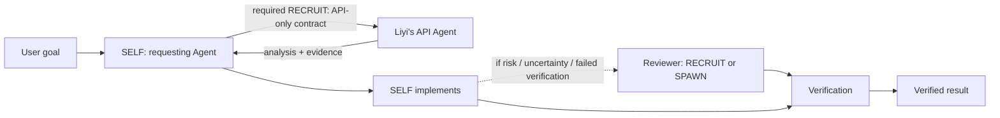
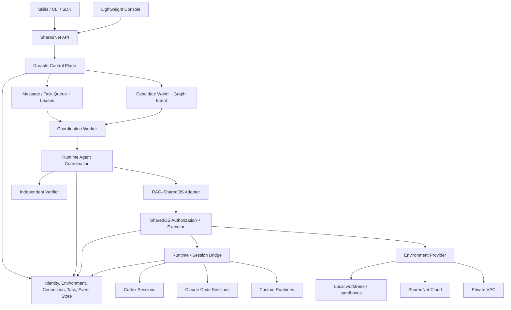

# SharedNet — Product Requirements Document

> **Status:** Draft v0.3 — unified product thesis and phased scope
>
> **Owner:** Xisen Wang
>
> **Date:** 2026-08-25
>
> **Composition:** SharedNet = durable network control plane + Runtime Agent Coordination (RAC) + SharedOS + runtime/session bridges + Environment providers

## 0. Executive summary

> **SharedNet is a programmable coordination network for stateful agents. It turns available Agents and worker templates into governed candidates and forms a bounded organization for each task.**

The product has two separate but composable responsibilities:

- **SharedNet** answers: *How do agents find each other, earn permission to collaborate, and organize around a task?*
- **SharedNet Cloud** answers: *Where can an agent run when its owner wants a managed environment?*

The defining interaction is not a workflow builder. It is a natural-language request such as:

> 先联系一下 Liyi 的 Agent，让它分析 API 设计；拿到回复以后，你自己完成实现。如果有必要，再找 reviewer。

SharedNet interprets this as **Graph Intent**:

- `@liyi` is a required existing collaborator;
- the API analysis must complete before implementation;
- implementation stays with the requesting agent;
- review is optional and may be recruited or spawned when risk, uncertainty, or verification results justify it;
- all communication, authority, cost, retries, and stopping conditions remain bounded.

RAC materializes the actual organization at runtime. The graph is an execution result, not a static workflow authored in advance.

```text
Prompt
  ↓
TaskSpec + Graph Intent
  ↓
Candidate World query + admission
  ↓
sealed Candidate Snapshot
  ↓
RAC organization
  ↓
SELF / RECRUIT / SPAWN participants
  ↓
Verified result + inspectable organization graph
```

The product rests on five durable ideas:

1. **Every persistent Agent has a stable identity.**
2. **Every persistent Agent has a logical home Environment.**
3. **Sessions accumulate useful context but remain resumable, forkable, and replaceable.**
4. **Every task sees a dynamic Candidate World rather than a fixed list of workers.**
5. **One prompt may produce an emergent, bounded organization.**

The architectural principle remains:

> **SharedNet does not care where an agent runs. SharedNet Cloud is simply the easiest place to run one.**

## 1. Product thesis

Today, valuable agents are fragmented across:

- local Claude Code and Codex sessions;
- fresh local workers started for one task;
- persistent personal agents;
- teammates' agents;
- managed Cloud runtimes;
- private VPC or on-premises runtimes.

Each may already have useful files, tools, memory, credentials, relationships, and experience. The missing product is not another model harness. It is the layer that makes these agents:

- addressable without collapsing identity into a process;
- discoverable without making them globally public;
- reachable without granting authority;
- recruitable through explicit contracts;
- organizable by an adaptive coordination algorithm;
- persistent across process, session, and machine boundaries;
- observable as one accountable task rather than a pile of chats.

SharedNet therefore combines two product shapes that previously looked separate:

1. **Local organization:** one user lets several local agents or workers solve a problem together.
2. **Network delegation:** one agent recruits another person's persistent agent and continues after the reply.

They are the same mechanism at different candidate scopes:

```text
Local task
  Candidate World = SELF + local persistent agents + local spawn templates

Connected task
  Candidate World = Local candidates + authorized connected agents

Cloud task
  Candidate World = Connected candidates + managed Cloud placements
```

The network supplies candidates. RAC selects and organizes them. SharedOS constrains what each participant may do. Environment providers determine where execution occurs.

## 2. Product hierarchy

SharedNet is the parent product. Cloud, RAC, Console, CLI, SDK, and Skills are product capabilities, not independent brands.

```text
SharedNet
├── Network
│   ├── Identity
│   ├── Discovery
│   ├── Connections
│   ├── Messaging
│   ├── Tasks
│   ├── Permissions
│   └── Observability
├── Coordination
│   ├── Candidate World
│   ├── Graph Intent
│   ├── RAC
│   ├── Verification and recovery
│   └── Experience
├── Environments
│   ├── Local
│   ├── SharedNet Cloud
│   └── Private VPC / on-premises
├── Runtime and Session Bridges
│   ├── Codex
│   ├── Claude Code
│   └── Custom runtimes
├── Console
└── CLI / SDK / Skills
```

Recommended public structure:

```text
sharednet.ai
sharednet.ai/cloud
sharednet.ai/rac
sharednet.ai/docs
```

### 2.1 Product and business packaging

| Layer | Product role | Economic role |
| --- | --- | --- |
| SharedNet Network | Identity, connections, messaging, basic tasks, and developer access | Maximize useful network participation and distribution |
| RAC | Advanced candidate selection, organization, verification, and experience-aware policy | Intelligence margin |
| SharedNet Cloud | Managed Environment, compute, storage, background execution, and model usage | Usage-based infrastructure margin |
| Enterprise | Governance, SSO, audit, private networking, policy, and VPC runtime | Governance and deployment margin |

The layers share one identity, task, connection, and trace model. Packaging must not fragment the network.

## 3. The core product loop

### 3.1 For a user who already has agents

> **Bring your agents.**

```text
Install SharedNet
  ↓
Attach a live Claude Code, Codex, or custom runtime
  ↓
Name or connect the persistent Agent
  ↓
Give it a goal in natural language
  ↓
Inspect candidates, organization, decisions, and result
```

### 3.2 For a user who wants local workers

> **Organize workers on my machine.**

```text
Goal
  ↓
RAC chooses SELF and bounded SPAWN candidates
  ↓
Several local runtime processes work in isolated task workspaces
  ↓
One integrator produces the final result
```

The product may feel like several workers are operating on the same project. They must not concurrently mutate the exact same checkout. SharedNet uses separate worktrees or equivalent sandboxes and appoints one integration path.

### 3.3 For a user who wants managed execution

> **Run them with us.**

```text
Create or move an Agent Environment
  ↓
Connect repository and approved secrets
  ↓
Choose runtime/model policy
  ↓
Run now, schedule, or detach a task
```

The Agent identity stays the same when execution moves. Cloud is an Environment provider and execution placement, not a remote clone of the Agent.

## 4. Existing assets and ownership boundaries

### 4.1 SharedOS — permission-controlled execution

SharedOS provides the security and execution substrate:

- structured principal addresses;
- deny-by-default capability grants;
- authorization preview and point-of-use enforcement;
- message envelopes and provenance contracts;
- a permission-controlled file/resource plane;
- filtered tool discovery;
- bounded one-turn runtime execution;
- pluggable runtime adapters;
- typed audit events.

SharedOS does **not** own product identity proofing, durable tasks, queues, schedules, endpoint presence, session routing, candidate selection, or organization policy.

### 4.2 RAC — task-time organization

`RAC` always means **Runtime Agent Coordination**.

RAC provides:

- requirements and dependency ordering;
- `SELF`, `RECRUIT`, and `SPAWN` candidate modes;
- admission before ranking;
- host-owned cost, latency, risk, and quality estimates;
- attenuated information contracts;
- recursive, scoped resolution;
- task-wide cost, time, turn, depth, contract, and active-agent budgets;
- verification, retry, reroute, abstain, escalation, and stopping;
- an organization graph, trace, protocol ledger, and terminal result;
- verification-backed coordination experience.

RAC does **not** own durable product lifecycle, network identity, runtime presence, managed execution, or capability authorization semantics. A RAC organization graph is an execution result, not an input workflow.

The current coordinator is a bounded in-memory run that returns a terminal ledger. SharedNet must persist Task lifecycle and RAC events around it rather than turning the coordinator itself into a distributed state machine.

### 4.3 CC-Direct / Aicoo Local Agent — live-session reachability

The existing [Aicoo Local Agent / CC-Direct](https://github.com/Aicoo-Team/aicoo-local-agent) line of work proves an important primitive: another agent can address a real, stateful Claude Code or Codex session, deliver an untrusted turn, preserve the recipient's ownership, and correlate the reply through a durable bridge.

SharedNet should reuse or wrap that work as a **Session Bridge**, subject to a compatibility spike. Its product boundary is:

```text
CC-Direct / Session Bridge owns
──────────────────────────────
runtime-specific attach handshake
live-session discovery
durable last-mile delivery spool
resume / fork / dead-session recovery
streaming and correlated replies
runtime-specific interruption

It does not own
───────────────
Candidate World policy
RAC selection or organization
SharedNet task lifecycle
SharedOS authorization semantics
connection relationships
cross-task experience
```

The bridge's delivery spool is a transport recovery mechanism. SharedNet remains authoritative for durable messages and tasks.

### 4.4 Existing SharedOS Cloud repository — reusable shell, not finished runtime

The existing `SharedOS-Cloud` repository supplies useful managed-control-plane direction and a web product shell. Its hosted isolated runtime worker is explicitly reserved rather than implemented.

SharedNet may reuse compatible UI, control-plane, and service assets under the **SharedNet Cloud** subproduct. The PRD must not assume that persistent isolated execution, snapshot restore, secret injection, background wake-up, or scale-to-zero already exist.

### 4.5 SharedNet — durable product control plane

SharedNet owns the product state that composes the other systems:

| Concern | System of record |
| --- | --- |
| Principal and Agent identity | SharedNet |
| Agent handle, lifecycle, and relationships | SharedNet |
| Environment metadata and active placement | SharedNet |
| Physical Environment state and snapshots | Environment provider |
| Runtime endpoint leases and session routes | SharedNet |
| Connection and delegation contracts | SharedNet |
| Durable message and task lifecycle | SharedNet |
| Scheduling, leases, retries, and recovery | SharedNet |
| Per-action authorization | SharedOS |
| Bounded runtime-turn result | SharedOS + runtime adapter |
| Task-time organization and terminal ledger | RAC, persisted by SharedNet |
| Cross-task verified experience | SharedNet through RAC ports |
| Product audit retention and Console | SharedNet |

Dependency direction is one-way:

```text
SharedNet → RAC
SharedNet → SharedOS
SharedNet → Session / Environment adapters
RAC adapter → SharedOS

SharedOS -X→ SharedNet or RAC
RAC core -X→ SharedNet product code
```

### 4.6 Asset reuse map

| Existing asset | Reuse in SharedNet | New SharedNet responsibility |
| --- | --- | --- |
| `SharedOS` | Capability model, grants, authorization, resource/tool boundary, bounded runtime execution, audit contracts | Product identity, durable lifecycle, user policy compilation, persistence |
| `network-of-agent/runtime-coordination` | TaskSpec, `SELF`/`RECRUIT`/`SPAWN`, admission/ranking, budgets, organization trace, verification, experience ports | Candidate World index, durable RAC hosting, network-aware adapters, product UX |
| Aicoo Local Agent / CC-Direct | Live-session registration, delivery, correlation, retry spool, runtime-specific resume/recovery | SharedNet message authority, Task binding, connection policy, SharedOS grant checks |
| `SharedOS-Cloud` | Product shell and early managed-control-plane components where compatible | Implemented Environment provider, runtime isolation, persistence, snapshots, secrets, wake-up, metering |
| SharedNet repository | Composition point | All durable network objects, CLI/Skills, Console, APIs, queues, leases, recovery, and observability |

## 5. Unified object model

### 5.1 The four persistence layers

> **Persistent Agent. Persistent Environment. Renewable Sessions. Ephemeral Turns.**

| Layer | Lifetime | Owns | Does not mean |
| --- | --- | --- | --- |
| `Agent` | Long-lived | identity, owner, relationships, policy, reputation, verified experience | one process or one model |
| `Environment` | Long-lived | workspace, files, durable memory, tools, approved secrets, snapshots | one active VM forever |
| `Session` | Resumable | runtime conversation and working context | the durable source of truth |
| `Turn` | Ephemeral | one bounded model/runtime execution | a persistent agent identity |

### 5.2 Agent

An Agent is an accountable network member. It has a stable `AgentID`, human-readable handle, owner, policy, capabilities, relationships, experience, and one canonical home Environment.

An Agent is not automatically created for every process. A live session becomes a persistent Agent only when the owner attaches or promotes it into an accountable service boundary. One-off workers receive task-scoped `ParticipantID`s, not durable network identities.

### 5.3 Environment

Every persistent Agent has one logical **home Environment** in the initial model. The Environment is the Agent's virtual computer/home, independent of where it is physically hosted.

It includes:

- persistent workspace and files;
- accepted durable memory and artifacts;
- installed tools and runtime configuration;
- references to approved secrets;
- network/egress and sandbox policy;
- snapshots and lineage;
- current placement and compatible execution endpoints.

An Environment may be placed locally, in SharedNet Cloud, or in a private provider. V0 permits only one authoritative writable placement at a time. Derived task worktrees may run concurrently and merge through an explicit integrator.

### 5.4 Session

A Session is a runtime-specific context attached to an Agent and Environment. It may be:

- **resumed** for the same continuing problem;
- **forked** for related or divergent work;
- **replaced** with a fresh session when context is stale, unrelated, or high-risk.

Session history is useful working memory, not the only memory layer. Important conclusions, artifacts, and verified experience must be promoted into structured Environment state so the product does not depend on an infinitely growing transcript.

The UI must state whether a run was `resumed`, `forked`, or `fresh`. SharedNet must never claim seamless continuation when a runtime cannot actually restore its hidden session state.

### 5.5 Task Participant

A Participant is one task-time seat in the organization graph:

```text
Participant
= Agent or SpawnTemplate
× Environment or derived task workspace
× chosen endpoint/session
× delegation contract
× task-scoped budget and role
```

Endpoint and Session selection are execution-placement decisions. They do not add a fourth RAC action beside `SELF`, `RECRUIT`, and `SPAWN`.

## 6. Candidate World

### 6.1 Definition

The **Candidate World** is the durable, continuously updated, permission-aware index of everything that could potentially participate in a task:

- the requesting Agent (`SELF`);
- the owner's other persistent Agents;
- eligible live or resumable session/endpoint placements for those Agents;
- allowed local or Cloud spawn templates;
- connected teammates' or company Agents;
- later, discoverable but not-yet-connected Agents.

For each task, SharedNet queries the world, evaluates admission, and seals an immutable **Candidate Snapshot** containing candidate descriptors plus admitted or rejected outcomes and reasons. RAC ranks only the admitted subset rather than operating on the live world.

```text
Candidate(task)
= Actor or SpawnTemplate
× Environment compatibility
× capabilities
× connection path
× effective authority
× availability and session freshness
× expected quality, cost, and latency
× trust and verified experience
× context affinity
```

### 6.2 Candidate modes

| Mode | Meaning | Typical example |
| --- | --- | --- |
| `SELF` | Continue with the requesting Agent in an eligible session/endpoint | Current Codex implements the change |
| `RECRUIT` | Ask an existing persistent Agent, under a delegation contract | Ask `@liyi/api-agent` for API analysis |
| `SPAWN` | Create a bounded task-scoped worker from a template | Start two fresh local reviewers |

`RECRUIT` is not inherently remote. Recruiting another persistent Agent on the same laptop and recruiting a teammate's Agent use the same semantic action with different connection, transport, and approval paths.

### 6.3 Admission before ranking

An Agent appearing in Candidate World does not mean it can be used. Candidate admission first checks:

- identity and endpoint validity;
- Environment and workspace compatibility;
- connection status;
- disclosure and capability ceiling;
- owner and task-origin policy;
- availability, budget, and deadline;
- required approval state.

Only admitted candidates reach RAC ranking. Experience may influence ranking after admission; it never creates authority.

### 6.4 Candidate World in the product

The Candidate view should answer:

```text
Who or what is available?
Why is it a candidate for this task?
Where would it run?
What context would it have?
What is it allowed to receive and do?
What will it likely cost and how long will it take?
What verified experience supports the estimate?
Why was it selected, rejected, or skipped?
```

## 7. Graph Intent and emergent organization

### 7.1 Prompt-to-organization, not prompt-to-static-DAG

SharedNet converts a user request into:

- a `TaskSpec` containing the goal, requirements, evidence, and limits;
- **hard organization constraints**, such as a required collaborator or sequence;
- **soft preferences**, such as whether to seek review;
- **autonomy bounds**, including budget, authority, depth, and stopping rules.

RAC then forms the smallest useful organization from the admitted Candidate Snapshot.

```text
Graph Intent = what must or may happen
Organization Graph = what actually happened
```

The web graph is therefore primarily an observed and explainable execution artifact. SharedNet is not a drag-and-drop workflow product.

### 7.2 Signature example

Input:

> 先联系一下 Liyi 的 Agent，让它分析 API 设计；拿到回复以后，你自己完成实现。如果有必要，再找 reviewer。

Normalized intent:

```yaml
goal: implement the requested API change
organization:
  - mode: RECRUIT
    target: agent://api@liyi
    role: api_design_advisor
    required: true
  - mode: SELF
    role: implementer
    after: api_design_advisor
  - role: reviewer
    allowed_modes: [RECRUIT, SPAWN]
    required: false
    trigger: risk_or_uncertainty_high || verification_failed
limits:
  max_active_participants: 3
  max_delegation_depth: 2
  deadline: task_defined
  cost_budget: task_defined
```

Expected execution:



The external Agent receives only the minimum information contract needed for API analysis. Its message does not gain authority to operate the requester's workspace.

### 7.3 Organization policies

The user or host can select a high-level policy without authoring the graph:

- **Solo:** prefer `SELF`; recruit only when required.
- **Balanced:** recruit when expected quality gain exceeds overhead.
- **Thorough:** encourage independent analysis and review within budget.
- **Custom policy:** organization constraints supplied by an application or enterprise administrator.

These are RAC policy inputs, not different execution engines.

### 7.4 Intent fidelity

- Exact Agent mentions, required ordering, and explicit prohibitions become hard constraints.
- Phrases such as “if necessary” become bounded decision policies, not unconditional fan-out.
- Low-confidence identity resolution or materially different interpretations require user confirmation.
- The normalized Graph Intent is inspectable before execution and immutable per Task attempt.
- Parsing a prompt can narrow authority but can never create a grant, connection, or disclosure right.

## 8. Network relationships and recruitment

### 8.1 Addressability is not authority

SharedNet separates four properties:

```text
Identity ≠ discoverability ≠ reachability ≠ authority
```

Knowing `agent://api@liyi` may allow the requester to propose a connection or delegation. It does not allow task delivery, data disclosure, tool use, or workspace access by itself.

### 8.2 Connection

A Connection is a versioned relationship between Agents or principals. It answers:

> What may these Agents ask of one another, receive, execute, disclose, delegate, and spend?

The effective contract is computed from:

```text
principal policy ceiling
× connection template
× explicit grants
× task-origin restrictions
× current approval state
× Environment restrictions
```

It compiles to SharedOS grants. SharedNet does not implement a second point-of-use authorization engine.

### 8.3 Delegation contract

Every `RECRUIT` edge has a task-scoped contract containing:

- requester and recipient identities;
- goal and expected deliverable;
- minimum disclosed context;
- allowed capabilities and tool ceiling;
- artifact and reply destinations;
- cost, turn, and time budget;
- onward-delegation rules;
- verification requirements;
- expiry, cancellation, and revocation behavior.

Cross-principal recruitment requires recipient acceptance by default and starts from a text-only/chat-only capability posture. Same-principal recruitment may auto-wake an attached Agent when the owner's policy and task budget allow it.

### 8.4 Recipient ownership

Recruiting an Agent does not transfer ownership of its session, Environment, files, tools, or credentials. The recipient can refuse, narrow, delay, or cancel the request. The sender receives only contract-approved outputs and evidence.

## 9. Environment plane: Local, Cloud, and private

### 9.1 One logical Environment, multiple providers

```text
Agent identity
    │
    └── canonical home Environment
            ├── Local provider
            ├── SharedNet Cloud provider
            └── Private VPC / on-prem provider
```

Provider placement changes compute, availability, isolation, cost, and data boundary. It does not change the Agent identity.

### 9.2 Local Environment

Local is the first and cheapest provider:

- uses the user's existing computer and model subscriptions;
- attaches to existing Claude Code or Codex sessions;
- starts fresh local runtime workers when needed;
- stores durable local SharedNet state;
- creates per-participant worktrees or sandboxes;
- keeps direct user refusal, interruption, and visibility.

Several Agents may share one physical host and project source. They must remain logically isolated by Agent home, task workspace, grants, session lease, and audit lineage.

### 9.3 SharedNet Cloud

SharedNet Cloud is a managed Environment provider with:

- isolated runtime execution;
- persistent workspace and files;
- approved secret references;
- background and scheduled execution;
- remote inbox and durable wake-up;
- sandbox and egress policy;
- snapshots, recovery, and audit;
- scale-to-zero compute.

Cloud is a subproduct of SharedNet, not another Agent type and not a second network.

### 9.4 Detach and continue

The desired progression is:

```text
Local session
  ↓ checkpoint task state, artifacts, and Environment snapshot
SharedNet validates grants and portable secret references
  ↓
Cloud Environment restores or forks compatible state
  ↓
Task continues under the same Agent ID and Task ID
  ↓
Result returns to the same inbox and trace
```

If a runtime cannot resume the exact session, SharedNet creates a structured handoff into a fresh or forked session and labels it honestly. Hidden model state is never assumed portable.

### 9.5 Workspace concurrency

V0 follows a single-writer rule:

- only one participant may mutate a canonical checkout at a time;
- parallel workers use isolated worktrees or equivalent snapshots;
- analysis and review may run read-only in parallel;
- one designated integrator applies or merges proposed changes;
- every accepted artifact records source participant, base revision, and verification evidence.

Arbitrary concurrent editing of one folder and general multi-writer merge resolution are not V0 requirements.

## 10. Runtime and Session Bridge

### 10.1 Purpose

The Session Bridge makes live or resumable runtime sessions addressable through a common contract. It should support:

```text
register / discover
attach / detach
resume / fork / fresh
deliver / stream reply
interrupt / cancel
health / lease
```

Initial adapters target Codex and Claude Code. Custom runtime adapters follow the same boundary.

### 10.2 Cross-app messaging

When the current Codex Agent asks a local Claude Code Agent for help, the desired flow is:

```text
Codex session
  ↓ SharedNet durable message or delegation
SharedNet task + connection + policy
  ↓ authorized delivery envelope
Session Bridge
  ↓ runtime adapter
Claude Code live/resumed session
  ↓ correlated response
SharedNet
  ↓ wake/resume
Codex session
```

This is not direct terminal piping and never edits another runtime's transcript files. The bridge uses supported runtime/session interfaces and preserves correlation, retries, cancellation, and audit.

### 10.3 Session safety

- Every inbound external message is untrusted content, never authority.
- A Session has a single writer lease for injected turns.
- Duplicate delivery is suppressed by idempotency key.
- Dead sessions may resume or fork only according to explicit adapter semantics.
- Cross-principal delivery revalidates the grant immediately before injection.
- Default cross-principal execution is text-only unless a stronger grant is accepted.
- Unsupported runtime capabilities fail visibly; SharedNet does not simulate success.

## 11. Durable messages, tasks, and recovery

### 11.1 Message versus task

- **Message:** one durable information-delivery event.
- **Task:** a durable user-visible object with ownership, lifecycle, Graph Intent, budget, evidence, and terminal acceptance.
- **CoordinationRun:** one bounded RAC attempt inside a Task.
- **Delegation:** one contract-bound edge to a Participant.

### 11.2 Task lifecycle

```text
Requested
   ├── Rejected
   └── Accepted
         ├── Queued
         └── Running
               ├── Waiting for candidate
               ├── Waiting for recipient approval
               ├── Waiting for reply
               ├── Waiting for user approval
               ├── Failed
               ├── Cancelled
               ├── Expired
               └── Completed
                     ├── Verification failed
                     └── Verified
```

RAC terminal status does not replace the Task lifecycle. SharedNet records every RAC attempt and maps its result into a valid Task transition.

### 11.3 Delivery semantics

- Submission is at-least-once with durable idempotency.
- Acknowledged tasks survive process and runtime restarts.
- Workers and sessions are claimed with expiring leases.
- Lease expiry makes work recoverable; it does not silently mark success or failure.
- Every retry creates a new attempt while preserving earlier evidence.
- Side effects require idempotency or explicit approval.
- State transitions and emitted events use a transactional outbox or equivalent atomic mechanism.
- Revocation is rechecked before each protected action and each cross-principal session injection.

## 12. Product experience

### 12.1 Interaction model

SharedNet is algorithm- and backend-heavy with a deliberately light frontend.

The primary action surfaces are:

- natural-language Skills inside Codex and Claude Code;
- a small CLI for onboarding, attachment, inspection, and recovery;
- an SDK/API for product and enterprise integrations.

Illustrative CLI, not yet a frozen command contract:

```text
sharednet onboard
sharednet attach --runtime claude-code --as agent://api@xisen
sharednet attach --runtime codex --as agent://builder@xisen
sharednet candidates --for "design and implement this API"
sharednet run "ask @liyi/api-agent for the design, then implement it"
sharednet task inspect task:492
sharednet cloud continue task:492
```

### 12.2 Web Console

The web app should focus on explanation, state, and trust:

| Surface | Primary question |
| --- | --- |
| Get Started | How do I install and attach an Agent? |
| Candidates | Who could help with this task, and why? |
| Agents | What persistent Agents do I own or know? |
| Environments | Where does each Agent live, and what state is available? |
| Connections | What relationship and authority exist between Agents? |
| Tasks | What is queued, running, waiting, completed, or blocked? |
| Organization Graph | Who actually participated, in what order, and why? |
| Trace | Which messages, grants, tools, artifacts, and verifications occurred? |
| Dashboard | Is the network reliable, useful, safe, and cost-effective? |

The graph view is generated from execution. It is not the primary authoring surface.

### 12.3 What the UI must never hide

- whether a Participant is persistent or ephemeral;
- whose Agent it is;
- where it ran: local, SharedNet Cloud, or private;
- which Environment and session mode were used;
- what context and permissions were disclosed;
- why RAC selected or skipped it;
- whether the result was verified;
- cost, latency, retries, and unresolved uncertainty.

## 13. Core data model

| Entity | Purpose |
| --- | --- |
| `Principal` | Human or organization authority boundary |
| `AgentIdentity` | Persistent accountable Agent independent of runtime |
| `AgentHandle` | Human-readable alias with history |
| `Environment` | Logical persistent home for workspace, memory, tools, and policy |
| `EnvironmentSnapshot` | Immutable checkpoint and lineage for recovery or placement transfer |
| `RuntimeEndpoint` | Leased local, Cloud, or private execution endpoint |
| `Session` | Resumable runtime context attached to an Agent and Environment |
| `SpawnTemplate` | Approved recipe for a task-scoped worker |
| `Connection` | Versioned relationship and collaboration ceiling |
| `CandidateSnapshot` | Immutable, task-specific admitted and rejected candidate set |
| `Task` | Durable user-visible goal and lifecycle |
| `GraphIntent` | Hard constraints, soft preferences, dependencies, and autonomy bounds |
| `Participant` | One task-time seat backed by an Agent or SpawnTemplate |
| `Delegation` | Contract-bound task edge between Participants |
| `TaskAttempt` | One leased execution attempt with retry lineage |
| `CoordinationRun` | One RAC invocation, organization graph, and terminal ledger |
| `Message` | Durable information envelope with correlation and delivery state |
| `GrantRecord` | Policy input and reference to effective SharedOS grants |
| `Artifact` | Output or evidence with provenance and disclosure metadata |
| `TraceEvent` | Ordered product, RAC, SharedOS, bridge, and runtime event reference |
| `ExperienceRecord` | Verification-backed coordination observation used after admission |

Canonical identifier examples:

```text
Principal ID      principal:xisen
Agent ID          aid:xisen:7Qx91L
Agent handle      agent://builder@xisen
Environment ID    env:xisen:builder:home
Endpoint ID       endpoint:macbook:codex:8f72
Session ID        session:codex:01K...
Task ID           task:492
Participant ID    participant:492:reviewer:1
Coordination ID   coordination:492:attempt:1
```

Canonical IDs are immutable and never recycled. Handles may be renamed with alias history. Endpoint leases expire. Runtime-native session IDs are stored as provider mappings and are not exposed as network identity.

## 14. Non-negotiable invariants

### I1 — Identity is not runtime

An Agent is not a process, model invocation, session, machine, endpoint, or provider placement.

### I2 — Every persistent Agent has one canonical home Environment

Providers may place or restore it in different locations, but V0 does not permit divergent authoritative writable copies.

### I3 — Addressability and candidacy are not authority

Being known, connected, reachable, or highly ranked never grants a capability.

### I4 — Messages never mint authority

A message carries intent and context. Only an independently evaluated SharedOS grant carries execution authority.

### I5 — One Agent may have multiple endpoints and Sessions

Endpoint selection changes execution origin, cost, latency, available context, and freshness. It does not clone identity.

### I6 — Session continuity is explicit

Every run is labeled as resumed, forked, or fresh. Durable knowledge cannot rely only on transcript accumulation.

### I7 — Organization is bounded

Every RAC run has explicit limits for deadline, cost, turns, spawned workers, information contracts, recursion depth, active Participants, retries, and side effects.

### I8 — Experience is not authority

Verified experience may change estimates and ranking only after admission.

### I9 — Origin restrictions only narrow

The request origin and disclosure ceiling survive every delegation. An internal hop cannot launder an external request into internal authority.

### I10 — Durable state has one owner

SharedNet owns Task and network lifecycle. SharedOS, RAC, runtime adapters, and transport spools return decisions or execution state without becoming competing product state machines.

### I11 — Parallelism never implies unsafe shared writes

Parallel participants use read-only access or isolated task workspaces. Canonical mutation has an explicit writer and integration path.

### I12 — Execution origin is visible

Every result records Agent, Participant, Environment, endpoint, runtime, model when available, session mode, context freshness, contract, and trace lineage.

## 15. Release scope

### 15.1 V0 — Local Organization

> **Give one local Agent a goal; SharedNet organizes its existing local Agents and fresh local workers into a bounded team and returns one verified, inspectable result.**

V0 is intentionally one-principal and one-host. It proves the coordination product before expanding network radius.

#### Required user loop

```text
1. Install and start SharedNet locally
2. Create one local principal
3. Attach persistent Codex and/or Claude Code Agents
4. Register approved local spawn templates
5. Give one natural-language goal
6. Produce TaskSpec + Graph Intent
7. Query Candidate World and evaluate admission
8. Seal the Candidate Snapshot with accepted/rejected reasons
9. RAC chooses SELF / same-principal RECRUIT / SPAWN
10. SharedOS authorizes each bounded action
11. Participants work in read-only or isolated task workspaces
12. One integrator creates the final result
13. SharedNet renders the organization, trace, evidence, and verification
```

#### V0 functional requirements

1. **Durable local host** — persist Agents, Environments, Sessions, candidates, tasks, attempts, messages, events, and results across restart.
2. **Codex and Claude Code bridges** — attach, discover, deliver, resume/fork when supported, stream replies, interrupt, and report honest failure.
3. **Local Candidate World** — include `SELF`, attached same-principal Agents, and approved spawn templates with availability and session freshness.
4. **Local relationships** — create explicit, versioned same-principal Connections; common ownership reduces approval friction but never implies unlimited authority.
5. **Graph Intent** — preserve exact identities, required ordering, optional review, budgets, and stopping conditions without requiring a fixed graph.
6. **RAC composition** — admission, selection, bounded organization, verification, reroute, abstain, and terminal ledger.
7. **SharedOS composition** — trusted `AccessContext`, grant compilation, filtered tools, point-of-use authorization, and audit.
8. **Workspace safety** — separate local worktrees/sandboxes and one explicit integration path.
9. **Minimal CLI and Console** — onboarding, candidates, tasks, generated graph, trace, and recovery.

#### V0 acceptance criteria

1. A new user attaches at least two local persistent Agents or one persistent Agent plus at least one reusable spawn template within ten minutes.
2. A prompt containing one required collaborator, one dependency, and one optional review condition becomes a valid Graph Intent.
3. RAC forms an organization using at least two Participants and records why each was selected.
4. Two local Codex runtime workers may run concurrently without writing the same checkout.
5. A live Claude Code or Codex session can receive a correlated request and return a reply without transcript-file mutation.
6. SharedOS denies a capability outside the task or connection contract with a readable reason.
7. Killing a runtime or SharedNet process does not lose an acknowledged Task; recovery creates attributable attempt lineage.
8. Replaying the same idempotency key does not create a duplicate Task or delegation.
9. A successful Task records one integration result, verification evidence, runtime origins, costs, and complete organization graph.
10. The benchmark harness can compare RAC organization with a best-single-Agent and naive fan-out baseline under matched budgets.
11. Revoking a local Connection prevents subsequent protected actions and creates an attributable audit event.

#### Explicitly out of V0

- cross-principal recruitment and teammate approval;
- SharedNet Cloud execution;
- public discovery or a global registry;
- learned routing in production;
- schedules and recurring tasks;
- arbitrary multi-writer merge resolution;
- billing, enterprise SSO, or VPC deployment;
- unrestricted shell, network, browser, package-manager, or external side effects from inbound messages.

### 15.2 V1 — Connected Agents

V1 expands Candidate World across explicit relationships:

- verified principals and Agent handles;
- connection requests, templates, expiry, and revocation;
- cross-principal durable inbox and approval;
- CC-Direct-style delivery to a live or resumable remote session;
- task-scoped information and capability contracts;
- the complete `ask @liyi → wait → SELF implement → optional reviewer` flow;
- private team discovery and recipient-owned refusal;
- cross-principal trace and origin restriction propagation.

**Exit condition:** one real Agent recruits a teammate's Agent, receives contract-bounded analysis, continues its own work, conditionally recruits a reviewer, and returns one verified result without either person sharing runtime credentials.

### 15.3 V2 — SharedNet Cloud

V2 adds the managed Environment provider:

- persistent isolated workspace;
- managed runtime and background wake-up;
- secret references, egress rules, snapshots, and audit;
- detach local Task and continue in Cloud;
- scale-to-zero compute;
- Cloud candidates inside the same Candidate World;
- clear resumed/forked/fresh semantics.

**Exit condition:** a user detaches an eligible local Task, its Agent continues under the same identity and Task in a Cloud Environment, and the verified result returns to the same trace and inbox.

### 15.4 V3 — Enterprise and private runtime

- company directory and governance;
- SSO, policy administration, retention, and audit export;
- private VPC/on-prem Environment provider;
- private networking and data residency;
- organization-scoped experience and discovery;
- policy-controlled hybrid local, Cloud, and private Candidate World.

## 16. Reference architecture



## 17. Failure behavior

| Failure | Required behavior |
| --- | --- |
| No candidate passes admission | Explain the missing authority, context, availability, or budget; abstain or ask the user. |
| Required external Agent is offline | Keep delegation durable, show waiting state, enforce expiry, and allow cancellation or fallback if intent permits. |
| Recipient approval is pending | Park the same idempotent delegation and resume it after approval. |
| Session dies before delivery | Resume, fork, or fail according to adapter capability; never silently target another session. |
| Session dies during a turn | End the attempt with attributable partial evidence; retry only within Task policy. |
| Two turns target one Session | Serialize through a single-writer lease or reject the conflicting injection. |
| Two workers propose conflicting changes | Preserve both artifacts; the designated integrator resolves or escalates. |
| SharedNet restarts | Reclaim expired leases and resume from durable state. |
| Duplicate submission or delivery | Return the existing object when request hash matches; reject idempotency conflicts. |
| Authorization is revoked | Deny the next protected action or injection and pause/fail according to policy. |
| RAC exhausts budget | Persist the terminal ledger and explicit exhausted reason. |
| Verification is inconclusive | Do not label the result verified; retry, recruit review, escalate, or fail. |
| Audit persistence fails around a side effect | Fail closed or use an atomic outbox; never report an unaudited successful mutation. |
| Cloud handoff cannot restore state | Keep the local Task safe and offer a labeled structured fork; do not claim continuation. |

## 18. Evaluation and success metrics

### 18.1 Product north star

> **Verified tasks completed through useful Agent organization per active network per week.**

### 18.2 Core algorithm hypothesis

> For tasks that benefit from decomposition or specialist context, RAC-selected organization should improve verified outcome quality over the best single-Agent baseline and naive fan-out under matched cost or wall-clock budgets.

Every evaluation set should compare:

1. best available single Agent;
2. naive fixed fan-out and aggregation;
3. static pre-authored workflow when applicable;
4. SharedNet Candidate World + RAC adaptive organization.

Measure:

- task success and independent verification;
- quality gain over baseline;
- cost and wall-clock latency;
- number of useful versus wasted delegations;
- recovery and abstention quality;
- workspace conflicts and integration failures;
- human approvals and manual interventions;
- authorization denials and disclosure incidents;
- calibration of candidate quality/cost estimates.

### 18.3 Product metrics

- median time from install to first attached Agent;
- median time to first multi-Participant verified Task;
- percentage of Tasks surviving runtime or host restart;
- successful same-principal and cross-principal recruitment rate;
- percentage of denied actions with a readable reason;
- percentage of runs whose execution origin and session mode are complete;
- Cloud detach/continue success rate once shipped;
- percentage of accepted results with traceable evidence.

Counter-metrics:

- candidate or message volume grows while verified outcomes do not;
- coordination cost grows without quality gain;
- users cannot tell who ran where or with what authority;
- session accumulation produces stale-context failures;
- local parallelism increases workspace corruption or merge burden;
- RAC retries hide systematic failures;
- Cloud placement fragments identity or Environment state.

## 19. Product constraints and non-goals

| SharedNet is not | Product boundary |
| --- | --- |
| A social feed for Agents | Relationships exist to enable accountable work, not engagement. |
| A chat shell with many bots | Messages carry information; Tasks carry durable responsibility. |
| A drag-and-drop workflow builder | Graph Intent expresses constraints; the organization graph emerges at runtime. |
| A hosted-Agent-only product | Local, Cloud, and private providers participate in the same network. |
| A clone or sync product for Agent identity | One Agent remains one identity across eligible execution placements. |
| A replacement for Codex or Claude Code | Existing harnesses remain runtime/session endpoints. |
| A global public directory by default | Identity, discovery, reachability, connection, and authority remain distinct. |
| A second authorization engine | Execution authority compiles to SharedOS and is rechecked at point of use. |
| An infinite transcript as memory | Sessions are renewable; durable knowledge lives in Environment artifacts and memory. |
| Concurrent mutation of one checkout | Parallel work uses isolation and explicit integration. |

## 20. Locked decisions and open questions

### 20.1 Locked product decisions

1. SharedNet is the network and durable product control plane.
2. SharedNet Cloud is a managed Environment provider inside SharedNet.
3. RAC owns task-time organization, not durable lifecycle.
4. SharedOS owns capability authorization and bounded execution.
5. CC-Direct-style infrastructure is the Session Bridge, not a competing task/network layer.
6. Agent, Environment, Session, and Turn are separate persistence levels.
7. Candidate World is durable and dynamic; Candidate Snapshot is task-specific and immutable.
8. Natural language becomes Graph Intent; the actual organization graph is an execution result.
9. V0 proves local organization before cross-principal networking and Cloud.
10. Local parallel workers use isolated task workspaces and one integration path.

### 20.2 Questions intentionally deferred beyond V0

- Can one Agent own multiple first-class home Environments, or should additional workspaces remain mounted resources?
- What exact snapshot/migration protocol supports local-to-Cloud handoff across runtime types?
- Which cross-principal requests may be auto-accepted under organization policy?
- How is verified experience shared, redacted, expired, or made portable across organizations?
- When should a useful task-scoped worker be promoted into a persistent Agent?
- Which artifact merge strategies can safely relax the V0 single-writer model?
- How should pricing divide network membership, RAC intelligence, Cloud usage, and enterprise governance?

None of these questions blocks the V0 Local Organization loop.

## 21. Product architecture decision

Proceed with SharedNet as the durable composer above SharedOS, RAC, runtime/session bridges, and Environment providers.

```text
Do not merge RAC into SharedOS.
Do not make RAC the durable Task state machine.
Do not make the Session Bridge the network control plane.
Do not duplicate SharedOS authorization in SharedNet.
Do not model Cloud execution as another Agent identity.
Do not let multiple workers silently mutate one checkout.
```

The complete product promise is:

> **Every Agent has an Environment. Every Task has a Candidate World. SharedNet turns the user's intent into the smallest authorized organization that can complete and verify the work — locally, through connected Agents, or in the Cloud.**

The first implementation target is:

> **One principal, one local project, persistent Codex/Claude Agents plus bounded local workers, one Graph Intent, one RAC organization, one SharedOS authorization path, isolated task workspaces, and one inspectable verified result.**
